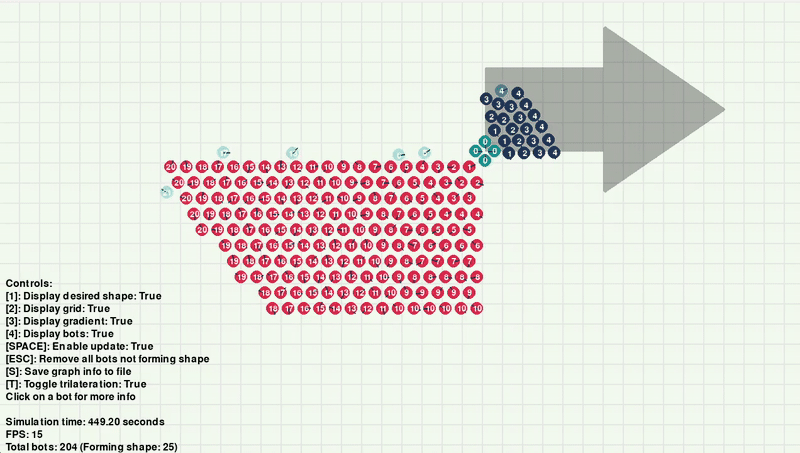

# README

## Project Overview
This repository contains the code for a **multi-agent system** simulation. This project includes:
1. A 2D environment that simulates interactions between different [Kilobot](https://ieeexplore.ieee.org/document/6224638) agents.
2. A multi-agent pattern formation algorithm for self-assembly based on [Programmable self-assembly in a thousand-robot swarm](https://www.science.org/doi/10.1126/science.1254295) by Rubenstein et al.

Given the image of a figure, the agents will move to fill the area of said figure. Agents do not know their initial position and can only communicate with their nearest neighbours.


*Pattern formation process*

## Further research and upgrades on original algorithm
As stated in the original paper of the algorithm and tested in this simulation, the proposed algorithm often presents a deformation in the final figure. Different tests where conducted to find the cause of this problem and fix it. More details are available in the [project's document](docs/final_project_Juan_Eizaguerri.pdf) (spanish).


*Pattern formation result example*
## Folder Structure
- `/src`: Source code for the project.
- `/docs`: Documentation and design files.

## Requirements
- Python 3.8+
- Required libraries:
    - `numpy`
    - `matplotlib`
    - `pygame`

## Usage
Run the main script to start the simulation:
```bash
python src/main.py
```